# DocumentClassification
Performance of various ML algorithms on Document Classification

# 1. [Build Naïve Bayes Model for Document Tagging](https://github.com/whatisname/DocumentClassification/tree/master/multipleTags)

## Introduction

The main task of this project is to design a program that accept a training dataset of labeled documents to train a Naïve Bayes classifier to classify new documents with satisficing accuracy. The program implements Naïve Bayes algorithm to perform probabilistic prediction on its input. Thus in this program, the assumption is that each word is individual from each other in training and testing datasets. The algorithm is totally implemented in Python language, by which I could build several different modules for the purpose of scalability and reusability. Code of three modules are in Attachment.

## Algorithm Demonstration

The main learning algorithm functions are listed below. The program uses VocTable first to read training data and generate vocabulary set and counting array, then calculates the probabilities of each word. Next, pass VocTable to Processor, which loop up and calculate probability of new words and overall probabilities regarding each category. Select the largest one as its predicted label and save to a 2d array too. (Equation showed in Figure1) At last, Processor generate confusion matrix and plot on the screen. Every probability is natural log transformed to preserve precision.

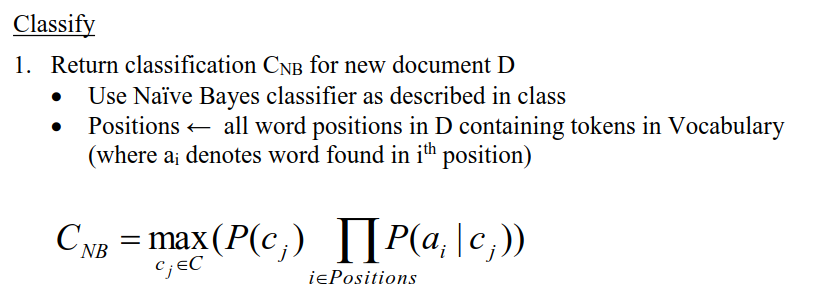

Figure1: The classifier this program uses to calculate the probabilities that a new document belongs to which class.

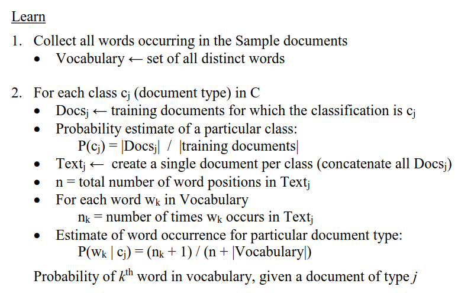

Figure2: Learning algorithm used in the program

Besides the main function, the two modules also provide some other functions. They all provide functions to save middle calculation results, for example, counting result, vocabulary set and probability table, result of prediction (table), statistics of prediction table (confusion matrix), save and reread in CSV format.   

They also provide different plot function. VocTable can plot top table of given number of most frequent word in each category or given categories (not implemented for now). Processor provides functions to plot confusion matrix/heatmap and bar plot of the category count of the training/testing set. Plots are included in later section.

During development, there is also other modules produced for data process: DocumentProcessor module (transfer another dataset to proper form for program input), plot support (plot module), diction look function (Dictionary module), word stemming function (PorterStemmer module).  Some of them are not all written by myself, the link will be listed in reference.

Main entrance is file “fileprocess.py”.

Table 1 Important modules/functions demonstration

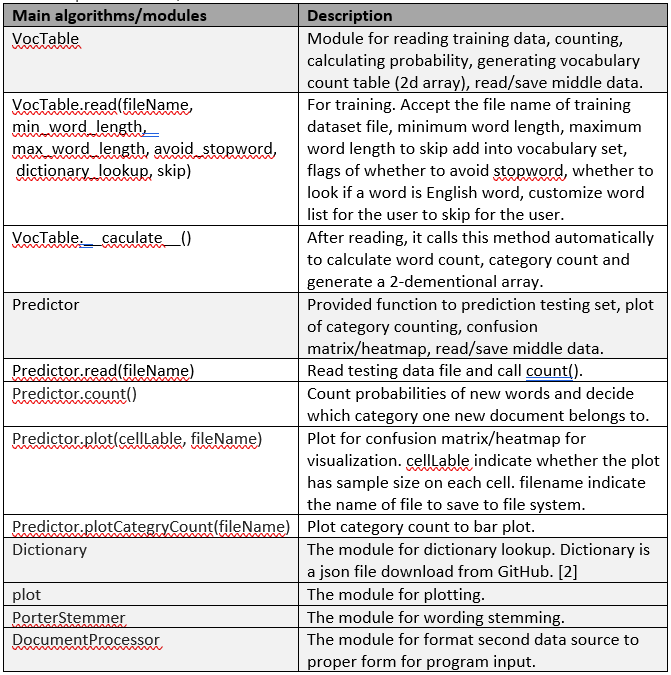

## Data Structure and Algorithm Logic 

The program uses 2d array to store word count, vocabulary probabilities and confusion matrix. Main document process logic does not use external library because of the performance was slow when I use third library (1 hour to process training data). I read the file in byte stream, separate word one by one and look if it already exists in vocabulary list. One of the main reasons that the program execution can be scaled down from more than 1 hour to about 30 second is that I used binary search each time I try to find in vocabulary set (it is implemented in all list and array retrieval). 

## Experiment Result and Compare

### 1 Experimental Version of Third library

First version is not completed. It uses “pandas” package data frame structure to store vocabulary. It is very slow because the logic in Figure2 is not efficient. Time spent: 1.2 hour (only the total time of reading training dataset).

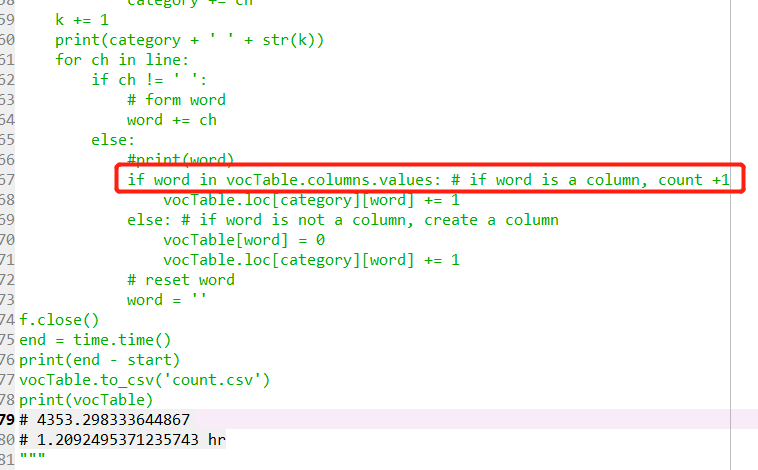

Figure3: First Version (experimental stage of document reading algorithm) The line in read square took too much time. Full code is in attachment.

## 2 Final Version (Self Written Core Process Code)

### 2.1 Count all word, no optimization process.

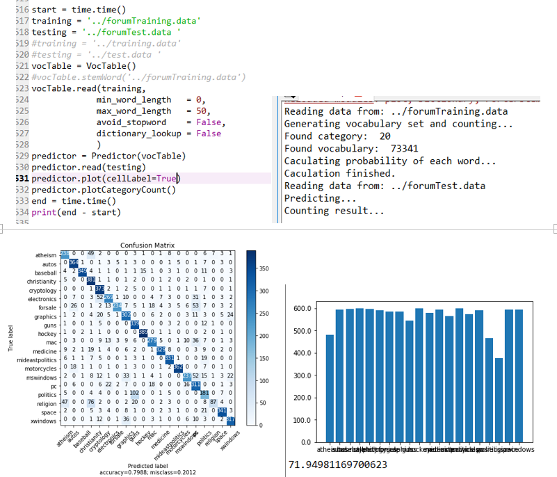

Figure4: Count all word, no optimization process. (1) Main function. (2) Program output. (3) Confusion matrix. (4) Bar plot of training set category count and total execution time in seconds.

### 2.2 Does not count word shorter than 2 chars, and larger than 30 chars. Avoid stopword. (Find on GitHub [3])

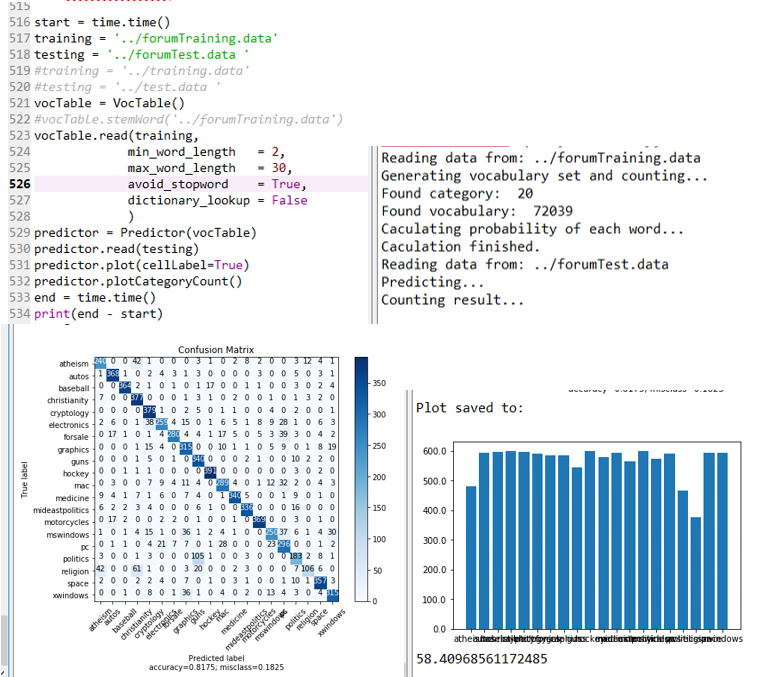

Figure5: Does not count word shorter than 2 chars, and larger than 30 chars. Avoid stopword. (1) Main function. (2) Program output. (3) Confusion matrix. (4) Bar plot of training set category count and total execution time in seconds.

### 2.3 Does not count word shorter than 2 chars, and larger than 30 chars. Avoid stopword. Dictionary look up. (Find on GitHub [3])

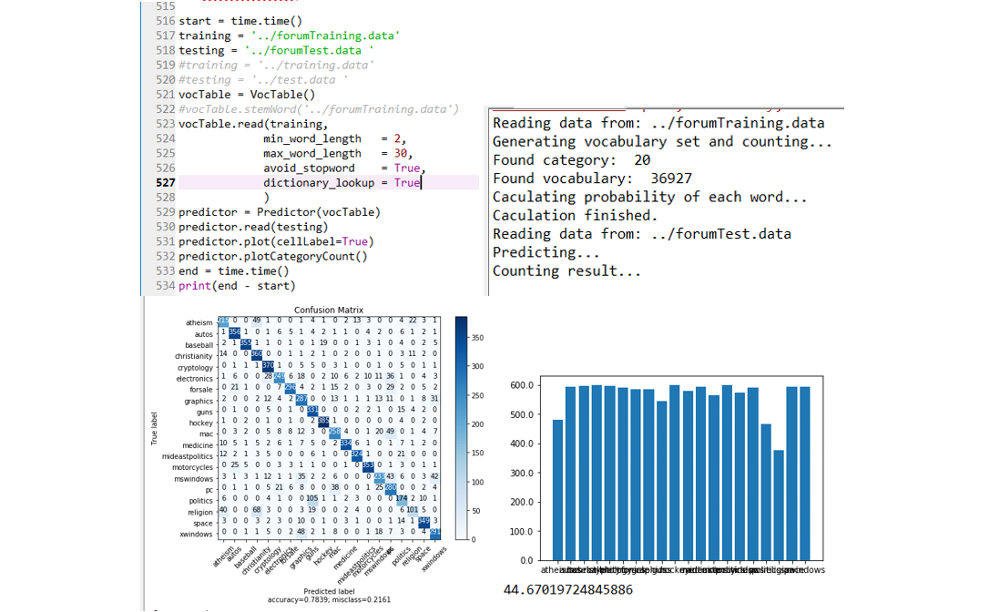

Figure6: Does not count word shorter than 2 chars, and larger than 30 chars. Avoid stopword. Dictionary look up. (1) Main function. (2) Program output. (3) Confusion matrix. (4) Bar plot of training set category count and total execution time in seconds.

### 2.4 Word stemming preprocess. Does not count word shorter than 2 chars, and larger than 30 chars. Avoid stopword. (Find on GitHub [3])

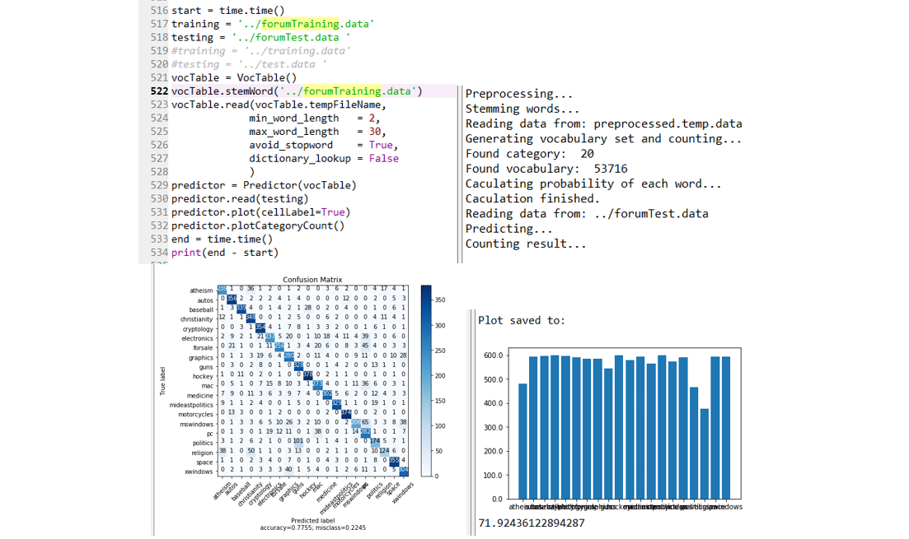

Figure7: Word stemming preprocess. Does not count word shorter than 2 chars, and larger than 30 chars. Avoid stopword. (1) Main function. (2) Program output. (3) Confusion matrix. (4) Bar plot of training set category count and total execution time in seconds.

### 2.5 Word stemming preprocess. Does not count word shorter than 2 chars, and larger than 30 chars. Avoid stopword. Dictionary lookup. (Find on GitHub [3])

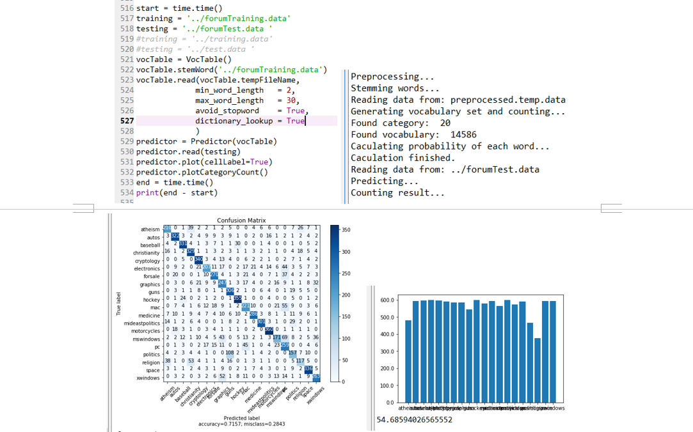

Figure8: Word stemming preprocess. Does not count word shorter than 2 chars, and larger than 30 chars. Avoid stopword. Dictionary lookup. (1) Main function. (2) Program output. (3) Confusion matrix. (4) Bar plot of training set category count and total execution time in seconds.

### 2.6 Use Reuters-21578 Text Categorization Collection (new dataset). [8] Does not count word shorter than 2 chars, and larger than 30 chars. Avoid stopword. No dictionary lookup. 

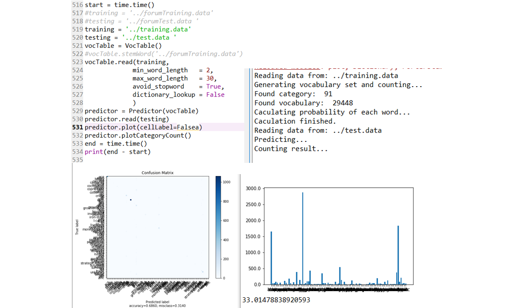

Figure9: Use Reuters-21578 Text Categorization Collection (new dataset). [8] Does not count word shorter than 2 chars, and larger than 30 chars. Avoid stopword. No dictionary lookup. (1) Main function. (2) Program output. (3) Confusion matrix. (4) Bar plot of training set category count and total execution time in seconds.

The result of 2.6 experiment is not well, it will be discussed in Discussion section.

## 3 Result Summary 

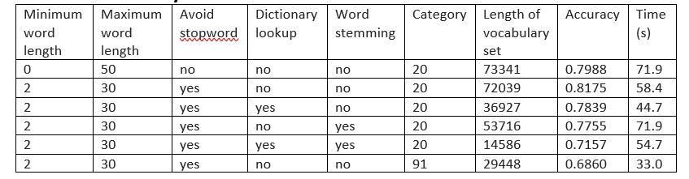

## Discussion

From the summary, the program has highest accuracy when it takes word of length 3-29 (only among these experiences, 3-29 might not be the best range), avoid stop word, but NOT check vocabulary in dictionary and stem word. The highest accuracy among these experiments is 81.75%. 

Another pattern that can be observed from the result is that with spell checking (dictionary lookup) and word stemming, the accuracy somehow decreased. By checking the vocabulary set, I found that the dictionary I found is not complete. Some words, especially for jargon in some area, program will rule out them because it is not in dictionary. For example, “ascii’, “cmd”, “uwaterloo”, “ctx”, “harddisk”. Two main reasons might lead to the decrease of accuracy. First, dictionary is not complete. Common computer word “harddisk” is not included in it. Second, dictionary does not record some abbreviations, but in fact, they usually have very high frequency in certain type of document. The reason of word stemming decreases accuracy remains unclear for now. But The vocabulary set decrease to half of the original size after stemming. Therefore, it could be related to the decrease on the quantity of the training vocabulary set.

From confusion matrix, “Politics” and “religion” has the higher misclassification rate, documents are easily to be misclassified to “PC”. In future work, those three classes could be the focus of misclassification analysis.

In addition, the program does not perform well in in experiment 2.6. The accuracy drops to 68.6%. The assumption is that there are 91 class (Figure9 (4)) and a large portion of classes have insufficient data sample. From Figure9 (3,4) the class with larger sample has higher prediction accuracy. In future, work, it is also a worthwhile direction to remove classes with insufficient sample size.

## Future Work

1.	Select another dataset and test the algorithm. 
2.	Find best word range (minimum word length and maximum word length). From the summary, the program has highest accuracy when it takes word of length 3-29. (only among these experiences
3.	Find other factor that can affect accuracy.
4.	Find the relation between words.
5.	Analyze massified document.

## Reference

[1] Project Instruction Document
[2] English-words project on GitHub| download link: https://github.com/dwyl/english-words/blob/master/words_dictionary.json
[3] NLTK's list of english stopwords project on GitHub | download link: https://gist.github.com/sebleier/554280 

Code reference

[4] Plot a Confusion Matrix on Kaggle| confusion matrix plot:  https://www.kaggle.com/grfiv4/plot-a-confusion-matrix

[5] Custom Ticker1 on matplotlib | https://matplotlib.org/gallery/ticks_and_spines/custom_ticker1.html#sphx-glr-gallery-ticks-and-spines-custom-ticker1-py

[6] The Porter Stemming Algorithm, Python algorithm by Vivake Gupta, recent release date July 2008| http://www.tartarus.org/~martin/PorterStemmer

[7] Dictionary look algorithm | https://github.com/dwyl/english-words

[8] Reuters-21578 Text Categorization Collection| https://archive.ics.uci.edu/ml/machine-learning-databases/reuters21578-mld/reuters21578.html

# 2. Spam Filter
